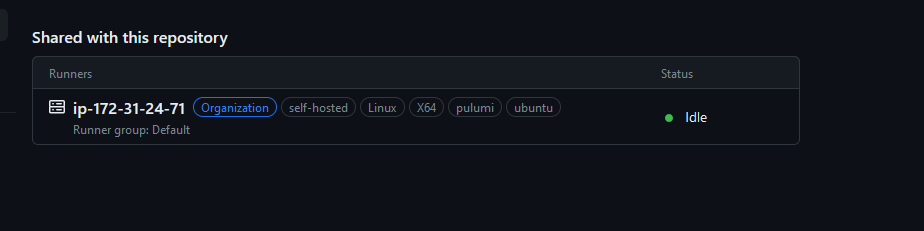

[](https://app.pulumi.com/new?template=https://github.com/BOM-DEMO/infrastructure/tools/olufi/README.md)

# Olufi

This deploys a simple AWS EC2 virtual machine running a Github actions runner.

## Deploying the App

To deploy your infrastructure, follow the below steps.

### Prerequisites

1. [Install Pulumi](https://www.pulumi.com/docs/get-started/install/)
2. [Configure AWS Credentials](https://www.pulumi.com/docs/intro/cloud-providers/aws/setup/)
3. [Install Doppler CLI](https://docs.doppler.com/docs/install-cli)
4. Access to the BOM-DEMO Pulumi organization
5. Access to the BOM-DEMO Doppler organization

### Steps

After cloning this repo, from this working directory, run these commands:

1. login to doppler, you should have access to the BOM-DEMO organization

    ```bash
    $ doppler login
    ```

2. Configure the doppler CLI to read from the correct project, this will use the doppler.yaml file in the repo to configure

    ```bash
    $ doppler setup
    ```

3. login to pulumi backend

    ```bash
    $ pulumi login
    ```

4. Stand up the infrastructure

    ```bash
    $ doppler run pulumi up
    ```

5. After a few minutes, you can validate in the github actions settings that the runner is available and in an idle state





### Explanation

This is a fairly simple example of using Pulumi to deploy a single EC2 instance in an AWS account.

#### Pulumi

All of the pulumi code is stored in index.js, it simply creates an ec2 instance and runs a script (files/init.sh) on startup which installs all dependent software.  Some configurations can be found in Pulumi.dev.yaml, currently only the aws region which is set to us-east-2


#### Doppler

Doppler is a secrets management SaaS, in this case we are using it to store any authentication tokens used for installing the software on the olufi instance.  e.g. GITHUB_PAT_TOKEN for the actions runner to authenticate with the BOM-DEMO github organization when registering the runner